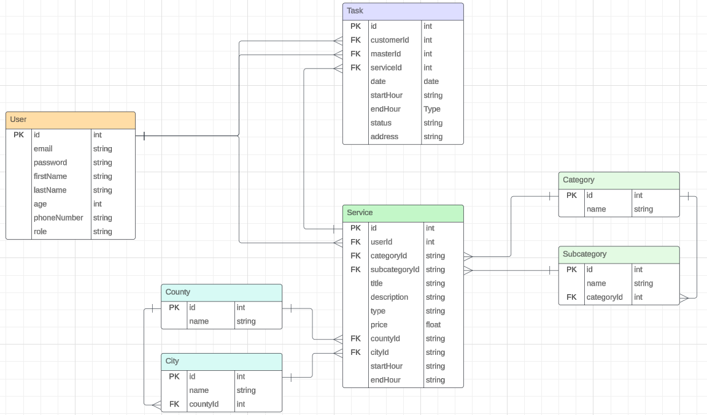

# iNeedMaster
Contact  
Email: alexandrucermac@gmail.com  
Phone number: 0743939803

View live demo: <a href="https://ineedmaster.vercel.app">ineedmaster.vercel.app</a>

Mention: The front end is implemented using React (Next.js) and is stored in another GitHub repository. **[Click here to open repository](https://github.com/alexcermac/ineedmaster_client)**

### Table of contents
1. [Description](#description)
2. [Technologies](#technologies)
3. [A few steps on how I built it](#a-few-steps-on-how-i-built-it)  
   3.1 [Class diagram and normalization](#class-diagram-and-normalization)  
   3.2 [Customer flow diagram](#customer-flow-diagram)  
   3.4 [Architecture](#architecture)  
   3.5 [Build and Deploy](#build-and-deploy)  
4. [Installation](#installation)  
5. [Demo accounts](#demo-accounts)  
6. [Future updates, problems, things that need to be fixed](#future-updates-problems-things-that-need-to-be-fixed)

##  1. Description

This project represents a platform based on Spring Boot on the back end following SOLID principles, it is deployed on AWS EC2 with the help of docker compose, the platform whose main purpose is to connect clients who need certain services with masters who offer services such as plumber, electrician, builder, and so on.
The platform provides authentication functionality and allows users to create accounts with the role of client or master.
Customers can search for services available in a specific city according to certain filters such as categories and subcategories of services, and they can make a reservation for these services if they are registered and authenticated on the platform. Masters can create new services that they offer, and accept or refuse reservations (Tasks) made by customers.

**The words solution and service will be used with the same meaning, because initially I thought of the project using the word service, which makes more sense in this context, but this word is reserved for spring boot*

##  2. Technologies
- Java Spring Boot, JPA
- PostgreSQL
- Docker, docker compose
- AWS EC2, Route 53

##  3. A few steps on how I built it

###  3.1 Class diagram and normalization
Class diagram final form:

  
Click to see Normalization steps
 
I started from the following ER Diagram:  

<ul>
	<li>
		<h4>1-st Normal Form</h4>
		
Is fulfilled from the very beginning, thus obtaining atomocity.

	</li>
	<li>
		<h4>2-nd Normal Form</h4>
		<ol>
		<li>
		
For User and Task entities we have the same "problem", namely for 2 attributes we put the question "To make use of Enum or to create a new small table?". For the design of this project I choosed to use Enum, and some reasons are reducing the number of JOINs, the fact that the values will not change or multiply (so you won't need a programmer to make changes), small size in memory.

		<ul>
		<li>
			
At the User entity, the attribute "role" break the 2NF. For this attribute I created in Spring project a Role Enum that holds the values: CUSTOMER and MASTER.

		</li>
		<li>
			
Same for Task entity on attribute "status", I created a Status Enum that holds the values: PENDING, ACCEPTED, DONE, DENIED and CANCELED.

		</li>
		</ul>
		</li>
		<li>
			
For the Service entity, we have County, City, Category and Subcategory attributes that breaks the 2NF, and I solved this with the second option, that is to create a new separate table for each of these attributes.

		</li>
		</ol>
	</li>
	<li>
	
How the diagram looks after I did the 2-nd Normal Form

	
	</li>
	<li>
		<h4>3-rd Normal Form</h4>
		
If we exclude "role" from User, "status" from Task and "type" from Service, the details of which we discussed above, we can say that the database is now also in 3rd Normal Form.

	</li>
</ul>

###  3.2 Customer flow diagram

###  3.3 Architecture
I used the classic spring boot approach, namely **layer architecture**, the layers being **Controller, Service, Repository**.

###  3.4 Build and Deploy
To make the deployment on **AWS EC2** easier I used **Docker** and **docker compose**. I stored the docker image of the project on docker hub, to access it from the docker compose file that is stored on EC2.
To deploy the project on EC2 I created a new instance of it on AWS, updated the system apps, installed docker and docker compose, create docker-compose file, edit this file and the last step being the launch of containers with docker-compose, just like we do locally.

##  4. Installation

<ol>
	<li>
		
Clone this repository

	</li>
	<li>
		
Make sure you are using Java 17 and Maven 3.8.4

	</li>
	<li>
		
Modify the `application.properties` file to configure the database settings.

	</li>
	<li>
		
You can build and run the project by running  `mvn clean package spring-boot:run`

	</li>
</ol>

##  5. Demo accounts
With these demo accounts you can view some dummy data + play a little bit with the platform.

### Master:
email: demo_master@gmail.com  
password: pass

### Customer:
email: demo_customer@gmail.com  
password: pass

##  6. Future updates, problems, things that need to be fixed
<ul>
	<li>
		
A <b>business problem</b> with this platform is <b>the communication</b> between the client and the one who provides the services on the part of setting the date and time. That is, the client can only offer a variant of the date and time interval, and the service provider can accept or refuse.

	</li>
    <li>
         
Adding the possibility for masters to <b>upload images</b> to the services that they provide.

    </li>
	<li>
		
For the task and booking part, I think it would be a better approach if the client post the service he needs in a specific category, and for the masters to choose the works they can provide.

	</li>
	<li>
		
I don't think I would choose the <b>structuring of the folders</b> and the file the way I did (although I tried to make the project as organized as possible, it seems to me that it's a bit chaotic after more and more files are added)

	</li>
	<li>
		
Master receives <b>notifications</b> when a new request is made for a task, and the customer receives a notification when the status of the task changes.

	</li>
	<li>
		
Some improvments for better handling the errors.

	</li>
</ul>